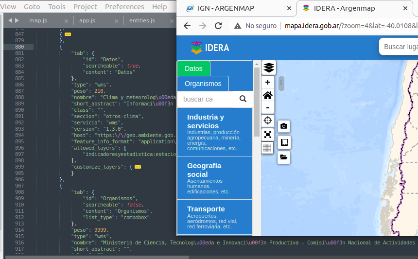
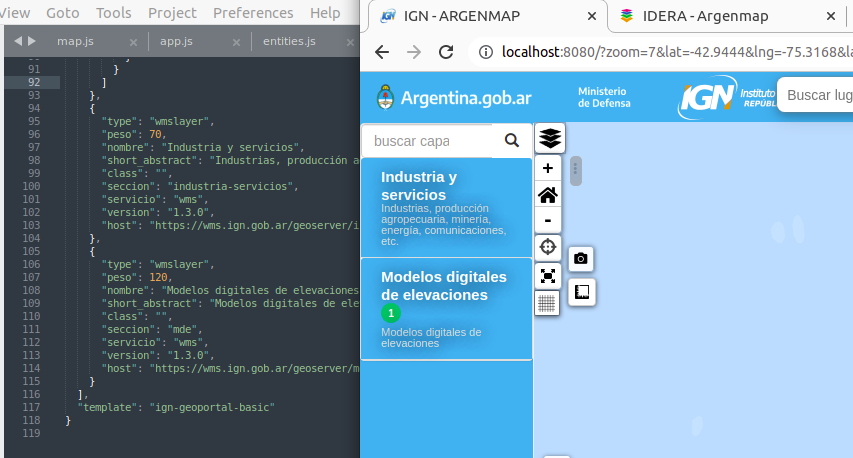

# MenuStyler
Menu styler for Argenmap

- Permite convertir solapas fantasma en solapas con nombre.
- Permite cambiar el impresor del menú lateral y redibujarlo para menúes con forma completamente personalizada (svg, jpg, otro) [en construccion]

### Solapas Fanstama

Para entener que es una solapa fantasma vamos a repasar
- Que es un item
- Que es una capa
- Que es una seccion
- Que es una solapa

### Configuración del Mapa

Los mapas base y capas se definen en el archivo `src/config/data.json`, la ubicación y zoom iniciales junto a otras opciones en `src/config/preferences.json`, ambos deben ser creados sino se carga la configuración por defecto en `src/config/default`.

---
### Capas, Secciones y Solapas

El archivo `data.json` se compone de bloques llamados **items**, el primero agrupa los mapas base y los siguientes las **secciones** desplegables que agrupan capas.

Dentro del archivo `data.json` se pueden agregar servicios WMS y WMTS.

En "items" se pueden definir servicios, cada uno dentro de un bloque (encerrado entre llaves "{}"). Cada bloque sirve para que la aplicación solicite el documento de capacidades al servicio WMS / WMTS, ese archivo contiene un listado de las capas que publica. Con esa información la aplicación genera de forma automática en el **panel de capas o menú lateral** una sección colapsable que contiene las capas de ese servicio como se ve en la siguiente imagen.

### Solapas

Argenmap ofrece la posibilidad de agrupar las **secciones** en diferentes **solapas**, para lograr esto solo se debe incluir la información de la solapa junto a la informacion de la seccion en el data.json

Ejemplo de json con 2 solapas
```json
        {
            "tab": {
                "id": "Datos",
                "searcheable": true,
                "content": "Datos"
            },
            "type": "wms",
            "peso": 210,
            "nombre": "Clima y meteorolog\u00eda",
            "short_abstract": "Informaci\u00f3n clim\u00e1tica y meteorol\u00f3gica",
            "class": "",
            "seccion": "otros-clima",
            "servicio": "wms",
            "version": "1.3.0",
            "host": "https:\/\/geo.ambiente.gob.ar\/geoserver\/wms",
            "feature_info_format": "application\/json",
            "allowed_layers": [
                "indicadoresyestadistica:estaciones_meteorologicas"
            ],
            "customize_layers": {
                "indicadoresyestadistica:estaciones_meteorologicas": {
                    "new_title": "Estaci\u00f3n meteorol\u00f3gica",
                    "new_abstract": "Instalaci\u00f3n destinada a medir y registrar regularmente diversas variables meteorol\u00f3gicas.",
                    "new_keywords": "estaci\u00f3n meteorol\u00f3gica, clima, meteorolog\u00eda, condiciones clim\u00e1ticas"
                }
            }
        },
        {
            "tab": {
                "id": "Organismos",
                "searcheable": false,
                "content": "Organismos",
                "list_type": "combobox"
            },
            "peso": 9999,

```
Menú resultante del json anterior


Una solapa puede tener muchas secciones, no se limita la cantidad.

## Mapas con una única solapa

Argenmap está pensado para ser utilizado facilmente, si el mapa sólo va a utilizar una única solapa no es necesario incluir en el data.json la información de ninguna solapa. El impresor del **menú lateral** incluirá todas las **secciones** dentro de la misma **solapa** sin nombre, creando de esta forma una **solapa fantama** 


Ejemplo de json con una solapa fantasma
```json
    {
      "type": "wmslayer",
      "peso": 70,
      "nombre": "Industria y servicios",
      "short_abstract": "Industrias, producción agropecuaria, minería, energía, comunicaciones, etc.",
      "class": "",
      "seccion": "industria-servicios",
      "servicio": "wms",
      "version": "1.3.0",
      "host": "https://wms.ign.gob.ar/geoserver/industria-servicios/wms"
    },
    {
      "type": "wmslayer",
      "peso": 120,
      "nombre": "Modelos digitales de elevaciones",
      "short_abstract": "Modelos digitales de elevaciones",
      "class": "",
      "seccion": "mde",
      "servicio": "wms",
      "version": "1.3.0",
      "host": "https://wms.ign.gob.ar/geoserver/modelos-digitales-elevaciones/wms"
    }
  ```
Menú resultante del json anterior

